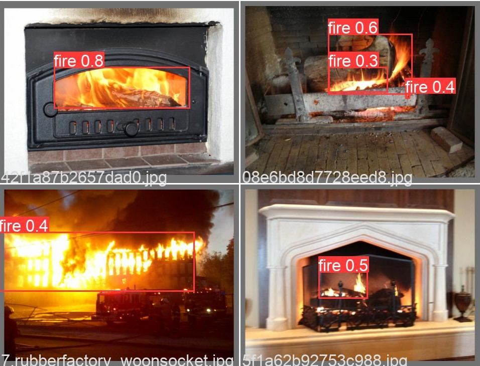
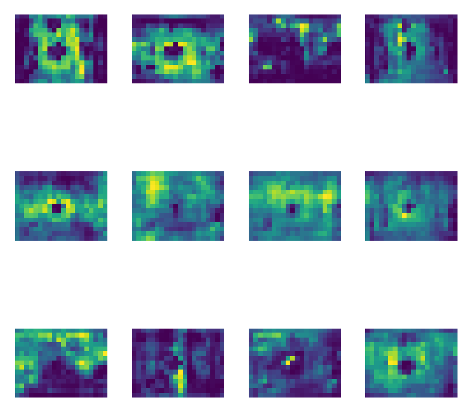

# Yolov5 for Fire Detection
Fire detection task aims to identify fire or flame in a video and put a bounding box around it. This repo includes a demo on how to build a fire detection model using Yolov5. 

<p align="center">
  
</p>

## Setup
Clone this repo and use the following script to install [yolov5](https://github.com/ultralytics/yolov5). Then download [fire dataset](https://mega.nz/file/MgVhQSoS#kOcuJFezOwU_9F46GZ1KJnX1STNny-tlD5oaJ9Hv0gY) and put it in datasets folder. This dataset contains samples from both [Kaggle fire & Smoke](https://www.kaggle.com/dataclusterlabs/fire-and-smoke-dataset) and [Fire & Guns](https://www.kaggle.com/atulyakumar98/fire-and-gun-dataset) datasets. I filtered out images and annotations that contain smokes & guns as well as images with low resolution, and then changed fire annotation's label in annotation files.

```
# Clone this repo
git clone https://github.com/spacewalk01/Yolov5-Fire-Detection

# Install yolov5
git clone https://github.com/ultralytics/yolov5  
cd yolov5
pip install -r requirements.txt  # install
```
Use [train.ipynb](train.ipynb) or the following commands for training & inference.

* Train
```
python train.py --img 640 --batch 16 --epochs 10 --data ../fire_config.yaml --weights yolov5s.pt --workers 0
```
* Inference
```
python detect.py --source input.mp4 --weights runs/train/exp/weights/best.pt --conf 0.2
```

## Result
The following results were produced after training yolov5s with input size 640x640 on the fire dataset 10 iterations. Note that I observed that the trained model tends to predict red emergency light on top of police car as fire. It might be due to the fact that the training dataset contains only a few hundreds of negative samples. I presume that we can fix this issue and further improve the performance of the model by adding images with non-labeled fire objects as negative samples. 

| P Curve | PR Curve | R Curve |
| :-: | :-: | :-: |
|  |  |  |

#### Prediction Results

| Ground Truth | Prediction | 
| :-: | :-: |
|  |  |
|  |  | 

#### Feature Map Visualization
It is desirable for engineers to know what happens under the hood of object detection models. Visualizing features in deep learning models can help us a little bit understand how they make predictions. In Yolov5, we can visualize features using ```--visualize``` argument as follows:

```
python detect.py --weights runs/train/exp/weights/best.pt --img 640 --conf 0.2 --source ../datasets/fire/val/images/0.jpg --visualize
```

| Input | Feature Maps | 
| :-: | :-: |
|  |  |

## Reference
I borrowed and modified [YOLOv5-Custom-Training.ipynb](https://github.com/ultralytics/yolov5/wiki/Train-Custom-Data) script for training Yolov5 model on fire dataset. For more information on training yolov5, please refer to its homepage.
* https://github.com/robmarkcole/fire-detection-from-images
* https://github.com/ultralytics/yolov5
