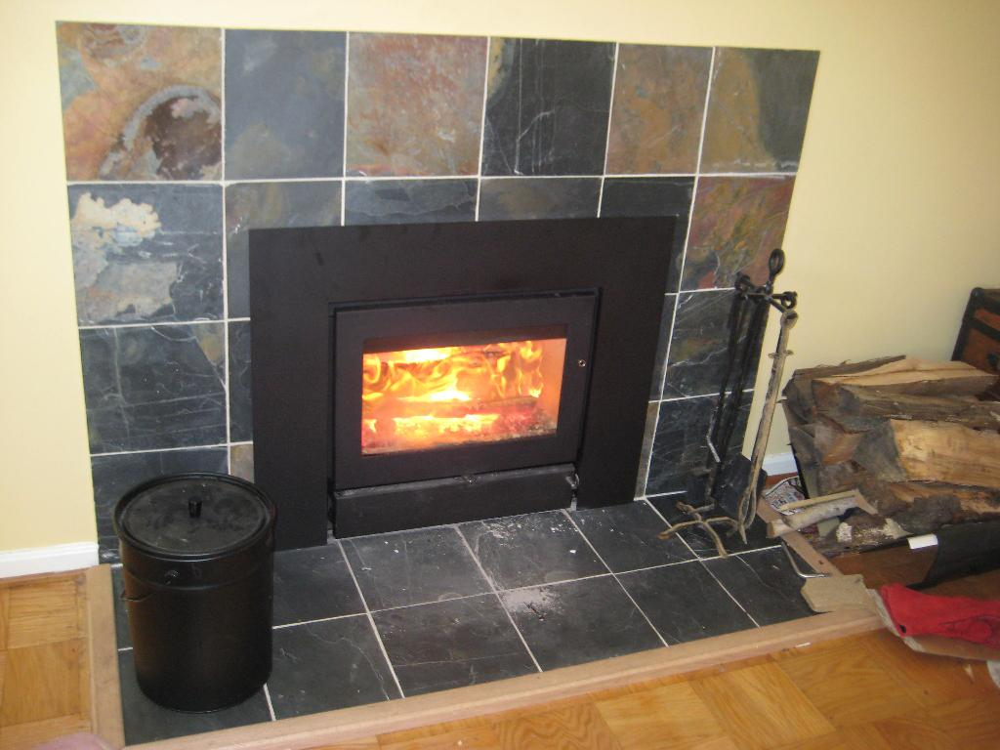

# Yolov5 for Fire Detection
The fire detection task aims to identify fire from a video and put a bounding box around it. In this repo, I trained yolov5 model to detect fire in images/videos. I borrowed and modified [YOLOv5-Custom-Training.ipynb](https://github.com/ultralytics/yolov5) script for training Yolov5 model on fire dataset. 

<p align="center">
  
</p>

## Setup
Clone this repo and use the following script to install [yolov5](https://github.com/ultralytics/yolov5). Then download [fire dataset](https://mega.nz/file/MgVhQSoS#kOcuJFezOwU_9F46GZ1KJnX1STNny-tlD5oaJ9Hv0gY) and put it in datasets folder. This dataset contains samples from both [Kaggle fire & Smoke](https://www.kaggle.com/dataclusterlabs/fire-and-smoke-dataset) and [Fire & Guns](https://www.kaggle.com/atulyakumar98/fire-and-gun-dataset) datasets. I filtered out images and annotations that contain smokes & guns as well as images with low resolution, and then changed fire annotation's label in annotation files.

```
# Clone this repo
git clone https://github.com/spacewalk01/Yolov5-Fire-Detection

# Install yolov5
git clone https://github.com/ultralytics/yolov5  
cd yolov5
pip install -r requirements.txt  # install
```
Use [train.ipynb](train.ipynb) or the following commands for training & inference.
* Train
```
python train.py --img 640 --batch 16 --epochs 3 --data ../fire_config.yaml --weights yolov5s.pt --workers 0
```
* Inference
```
python detect.py --source input.mp4 --weights runs/train/exp/weights/best.pt --conf 0.2
```
* Visualize feature maps
```
python detect.py --weights runs/train/exp/weights/best.pt --img 640 --conf 0.2 --source ../datasets/fire/val/images/0.jpg --visualize
```

## Result

| P Curve | PR Curve | R Curve |
| :-: | :-: | :-: |
|  |  |  |

I noticed that red emergency light on top of police car was being detected as fire. The current dataset also contains only a few hundreds of negative samples. I presume that we can further improve the performance by adding images with non-labeled fire objects as negative samples. It is also recommended to use as many images of [negative samples](https://github.com/AlexeyAB/darknet) as there are images with objects.

#### Prediction Results

| Ground Truth | 
| :-: |
|  |
| **Prediction** | 
|  | 

#### Feature Map Visualization

| Input | Feature Maps | 
| :-: | :-: |
|  |  |

## Reference
For more information on training yolov5, please refer to its official homepage.
* https://github.com/robmarkcole/fire-detection-from-images
* https://github.com/ultralytics/yolov5
